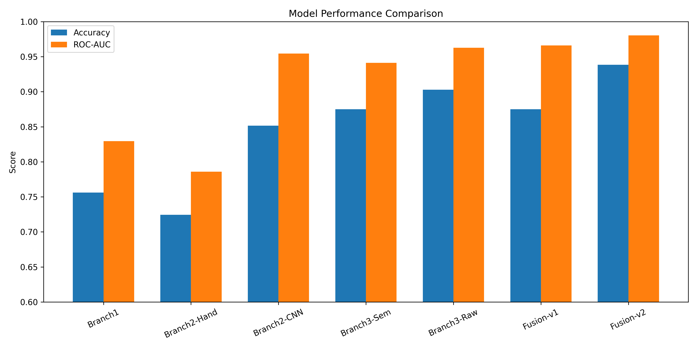
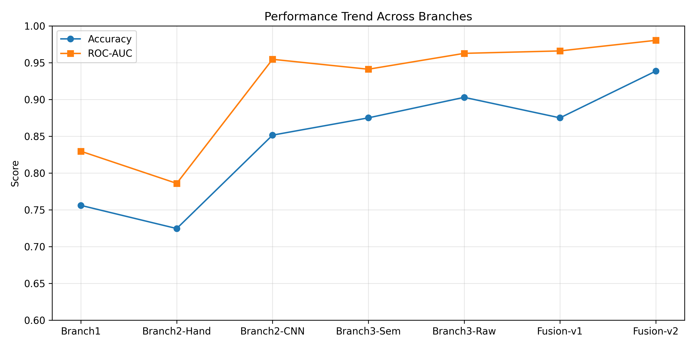

# Multi-Level-Feature-Learning-for-AI-Image-Detection
## Example Outputs





A multi-level feature learning framework for detecting AI-generated images using:

- Frequency-domain forensic features (FFT / DCT)
- Handcrafted texture descriptors
- CNN embeddings
- CLIP semantic representations
- Late feature fusion classifiers

## Results

The proposed multi-branch fusion pipeline improves robustness by combining low-level forensic signals with high-level semantic consistency features.

Evaluation includes:

- Confusion matrices
- ROC curves
- Cross-branch comparisons
- Fusion performance improvements

## Project structure

- `scripts/branch1`: Branch 1 extraction/training
- `scripts/branch2`: Branch 2 extraction/training
- `scripts/branch3`: Branch 3 extraction/training
- `scripts/fusion`: fusion model training
- `scripts/project_paths.py`: centralized paths and artifacts
- `scripts/split_utils.py`: shared global train/test split logic
- `scripts/predict.py`: single-image inference utility (Branch 1 or full Fusion)
- `figures/`: confusion matrices and performance figures

## Data layout

Expected structure under `data/`:

```text
data/
  ai/
  real/
```

## Setup

```bash
python -m venv .venv
source .venv/bin/activate
pip install -r requirements.txt
python scripts/project_paths.py
```

## Training pipeline (recommended order)

1. **Branch 1 features and model**
   ```bash
   python -m scripts.branch1.branch1_extract
   python -m scripts.branch1.branch1_train
   ```

2. **Branch 2 handcrafted and CNN features/models**
   ```bash
   python -m scripts.branch2.branch2_extract
   python -m scripts.branch2.branch2_cnn_extract
   python -m scripts.branch2.branch2_cnn_train_holdout
   ```

3. **Branch 3 embeddings/features/models**
   ```bash
   python -m scripts.branch3.branch3_clip_extract
   python -m scripts.branch3.branch3_train
   python -m scripts.branch3.branch3_clip_extract_v2
   python -m scripts.branch3.branch3_train_v2
   python -m scripts.branch3.branch3_raw_train
   ```

4. **Fusion models (with optional branch-level gating)**
   ```bash
   python -m scripts.fusion.fusion_train
   python -m scripts.fusion.fusion_train_v2
   ```
   Optional classifier selection:
   ```bash
   python -m scripts.fusion.fusion_train --classifier mlp
   python -m scripts.fusion.fusion_train_v2 --classifier mlp
   ```

## Reproducibility note

All training scripts now reuse a shared global split file at `splits/global_path_split.json` to reduce cross-branch split drift and leakage.

## Inference

Run full multi-branch fusion prediction on a single image:

```bash
python -m scripts.predict /path/to/image.jpg --mode fusion --fusion-version v1
```

Fusion-v2 inference:

```bash
python -m scripts.predict /path/to/image.jpg --mode fusion --fusion-version v2
python -m scripts.predict /path/to/image.jpg --mode fusion --fusion-model models/fusion/fusion_sgd.joblib --branch3-model models/branch3/branch3_semantic_lr.joblib
```

Or run Branch-1 only:

```bash
python -m scripts.predict /path/to/image.jpg --mode branch1 --branch1-model models/branch1/branch1_lr.joblib
```
